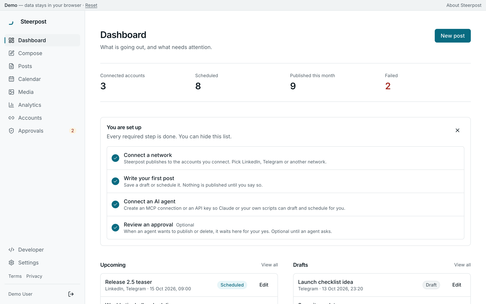
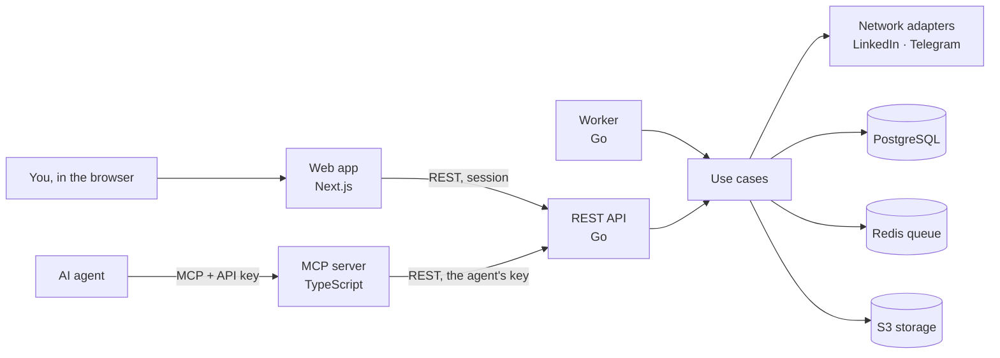

<p align="center">
  <picture>
    <source media="(prefers-color-scheme: dark)" srcset="docs/assets/wordmark-dark.svg">
    
  </picture>
</p>

<p align="center">
  <strong>One place to publish, for you and your AI agents.</strong><br>
  A self-hosted social media scheduler with a built-in MCP server. Agents draft and schedule; you decide what they may do.
</p>

<p align="center">
  <a href="https://github.com/XXX1694/SMSI/actions/workflows/ci.yml"></a>
  <a href="https://github.com/XXX1694/SMSI/actions/workflows/security.yml"></a>
  <a href="https://github.com/XXX1694/SMSI/releases"></a>
  <a href="#license"></a>
</p>

<p align="center">
  <a href="https://xxx1694.github.io/SMSI/demo/"><strong>Try the live demo</strong></a> ·
  <a href="https://xxx1694.github.io/SMSI/">Website</a> ·
  <a href="https://xxx1694.github.io/SMSI/docs/">Docs</a> ·
  <a href="#use-with-your-ai-agent">Connect an agent</a> ·
  <a href="docs/ROADMAP.md">Roadmap</a>
</p>

<picture>
  <source media="(prefers-color-scheme: dark)" srcset="site/src/assets/screens/dashboard-dark.png">
  
</picture>

> **Status: early (v0.1.0).** LinkedIn, Telegram, Discord, Mastodon and Bluesky publish today. More networks are planned, and the table below says
> honestly what each one needs. The demo runs entirely in your browser: no sign-up, nothing is sent anywhere.

## Why SocialOS

- **Built for agents, with a leash.** Claude, Cursor and other MCP clients can draft and schedule posts. Each agent gets a
  scoped, revocable key, risky actions need an explicit confirmation, and every call lands in the audit log.
- **Yours to run.** One `make up` starts the whole stack. Your accounts, tokens and posts stay in your own database, with
  tokens encrypted at rest and no third-party trackers.
- **Honest about networks.** Each network reports what it really supports. An unsupported feature fails with a clear
  reason; nothing is faked.
- **A post goes out once, on time.** Publishing is idempotent and retried only when that is safe. A crash leaves a post
  marked for review instead of posting it twice.

## Features

**Publishing**

- Write a post once, tailor the text per network and check live previews against each network's limits.
- Publish now or schedule it. See everything in a month, week or day calendar, in your timezone.
- Attach images and video from a media library (S3-compatible storage: the bundled MinIO, R2 or S3).
- Follow every post from draft to published, with the reason for each failure and a retry button.
- A dashboard of what is scheduled, what went out and what failed.

**For AI agents**

- An MCP server with 13 tools, over Streamable HTTP or stdio.
- Keys carry only the scopes you tick. Tools outside a key's scope are not even listed, and the API checks every call again.
- `publish_post`, `delete_post` and `disconnect_account` are off by default, and every call needs your approval in SocialOS before it runs.
- Every agent action is in the audit log, with an "Agent actions" filter.

**Self-hosting**

- Docker Compose for local use. For production: automatic HTTPS, deploys with automatic rollback, backups, pull-based
  updates from GitHub Releases, and a mode for servers that already run a reverse proxy.
- Multi-arch images (amd64, arm64) on GHCR.

**Not there yet:** a drag-and-drop calendar, a posting queue with time slots, threads, first comments, team workspaces and
approvals, and OAuth for MCP clients. The analytics page exists, but no connected network reports metrics yet. The
prioritised backlog is in [PRODUCT](docs/PRODUCT.md).

## Supported networks

Derived from the tiers in [PLATFORMS](docs/PLATFORMS.md) (checked 2026-10-09). Only ✅ networks work today; the rest are
plans, in roughly this order, with no dates.

| Network | Status | What it takes |
|---|---|---|
| LinkedIn (personal profile) | ✅ Live | Your LinkedIn app with "Share on LinkedIn". Text, up to 20 images, delete |
| Telegram (channels, groups) | ✅ Live | Your bot; you prove you control a chat with a one-time code. Text, images, video, delete |
| Discord (channel webhook) | ✅ Live | A channel webhook URL. Text, up to 10 images, delete |
| Slack | 🔜 Next | A channel webhook URL. Text only, without delete |
| Mastodon (and compatible servers) | ✅ Live | An access token from your instance. Text, images, delete |
| Misskey | 🔜 Next | An access token from your instance |
| Bluesky | ✅ Live | Your handle and an app password. Text with links and hashtags, up to 4 images, delete |
| Dev.to, WordPress, Ghost | 🔜 Next | An API key or application password; articles need a title |
| VK | 🔜 Next | A community access key, after a live check |
| Threads, Instagram, Facebook Pages | 🔜 Next | Your own Meta app. Works for your own accounts; anyone else needs Meta App Review. Instagram needs a Business or Creator account |
| Tumblr | 🔜 Next | Your own Tumblr OAuth app |
| Nostr | 🔜 Next | Waits for a decision on how to hold the key |
| X | 🔐 Needs review | Paid API, charged per post |
| LinkedIn company pages | 🔐 Needs review | LinkedIn's Community Management API approval |
| YouTube, TikTok | 🔐 Needs review | Google verification or a TikTok audit; until then, posts are private only |
| Reddit, Pinterest, Max | 🔐 Needs review | Platform approval or a verified business profile |
| Hashnode | 🔐 Needs review | A paid Hashnode plan |
| Medium, WhatsApp Channels | ⛔ Not possible | No usable official API |

✅ publishes today · 🔜 planned, needs no platform review · 🔐 needs app review, verification or a paid API · ⛔ no
official way to post. Setup for the live networks: [LinkedIn](docs/integrations/linkedin.md),
[Telegram](docs/integrations/telegram.md), [Discord](docs/integrations/discord.md),
[Mastodon](docs/integrations/mastodon.md) and [Bluesky](docs/integrations/bluesky.md).

## Use with your AI agent

Agents connect to the MCP server with an API key. In SocialOS, open **Developer → MCP connections**, name the
connection, tick the scopes you are comfortable with and copy the key: it is shown once, together with a ready-to-paste
config. The MCP endpoint is `https://mcp.<your-domain>/mcp` on a server and `http://localhost:3333/mcp` locally.

> **Auth today is an API key** sent as `Authorization: Bearer sk_live_…`. OAuth 2.1 for MCP clients is planned and not
> available yet.

| Tool | Scope | Risk |
|---|---|---|
| `list_social_accounts`, `get_social_account` | `social:read` | safe |
| `list_posts`, `get_post`, `get_post_status` | `posts:read` | safe |
| `get_analytics` | `analytics:read` | safe |
| `create_draft`, `update_post` | `posts:write` | safe / low |
| `cancel_scheduled_post` | `posts:write` | medium |
| `schedule_post` | `posts:schedule` | medium |
| `publish_post` | `posts:publish` | **sensitive**, needs the owner's approval |
| `delete_post` | `posts:delete` | **sensitive**, needs the owner's approval |
| `disconnect_account` | `social:disconnect` | **critical**, needs the owner's approval |

Revoking a connection invalidates its key at once. Keys can never create keys or change account security. Replace
`mcp.example.com` and `sk_live_...` below with your own values.

<details>
<summary><strong>Claude Code</strong></summary>

```bash
claude mcp add --transport http socialos https://mcp.example.com/mcp \
  --header "Authorization: Bearer sk_live_..."
```

</details>

<details>
<summary><strong>Cursor</strong> (<code>~/.cursor/mcp.json</code> or <code>.cursor/mcp.json</code>)</summary>

```json
{
  "mcpServers": {
    "socialos": {
      "url": "https://mcp.example.com/mcp",
      "headers": { "Authorization": "Bearer ${env:SOCIALOS_API_KEY}" }
    }
  }
}
```

Set `SOCIALOS_API_KEY` in the environment Cursor starts from, or paste the key in place of the variable.

</details>

<details>
<summary><strong>Claude Desktop</strong> (<code>claude_desktop_config.json</code>)</summary>

Claude Desktop starts a local process. Bridge it to your server with [`mcp-remote`](https://github.com/geelen/mcp-remote) (community package, pinned to an exact version; upgrade it deliberately, never use an unpinned `npx -y`):

```json
{
  "mcpServers": {
    "socialos": {
      "command": "npx",
      "args": [
        "-y", "mcp-remote@0.14.3", "https://mcp.example.com/mcp",
        "--header", "Authorization:${SOCIALOS_AUTH_HEADER}"
      ],
      "env": { "SOCIALOS_AUTH_HEADER": "Bearer sk_live_..." }
    }
  }
}
```

Or run the SocialOS MCP server itself in stdio mode from a checkout (`cd mcp && npm ci && npm run build`):

```json
{
  "mcpServers": {
    "socialos": {
      "command": "node",
      "args": ["/path/to/SMSI/mcp/dist/index.js", "--stdio"],
      "env": {
        "SOCIALOS_API_URL": "https://api.example.com",
        "SOCIALOS_API_KEY": "sk_live_..."
      }
    }
  }
}
```

</details>

Then ask, for example: *"Write a post about my new Flutter project and schedule it for tomorrow 12:00 on LinkedIn and
Telegram."* More clients and every server option: [mcp/README](mcp/README.md).

## Quickstart

You need Docker with Compose, `make` and `openssl`.

```bash
git clone https://github.com/XXX1694/SMSI.git socialos && cd socialos
make up                       # writes .env with a fresh ENCRYPTION_KEY, then docker compose up -d --build
open http://localhost:3000    # register, then connect the "Mock Network" to try the whole flow
```

The mock network is on by default in development, so you can schedule posts and connect an agent without any real
credentials. Configuration, migrations, tests and running each part on its own: [Getting started](docs/GETTING-STARTED.md).

## Self-hosting

SocialOS runs on one small server with Docker. The production kit is in [`deploy/`](deploy/):

| You want to | Read |
|---|---|
| Deploy on a fresh server with automatic HTTPS | [deploy/README](deploy/README.md), sections 1–12 |
| Share a server whose reverse proxy already owns ports 80/443 | [Section 13: host-proxy mode](deploy/README.md#13-behind-an-existing-reverse-proxy-host-proxy-mode) |
| Let the server update itself from GitHub Releases | [Section 14: pull-based updates](deploy/README.md#14-pull-based-updates) |
| Cut a release | [Section 15: releasing](deploy/README.md#15-releasing) |
| Connect real networks | [Providers and OAuth setup](docs/integrations/README.md) |

You bring your own LinkedIn app and Telegram bot; nothing goes through a SocialOS-run service.

## Architecture



- The MCP server holds no state and no network credentials. It calls the REST API with the agent's own key, so it can
  never bypass authorization.
- The Go backend is hexagonal: pure domain rules, use cases behind ports, and adapters for Postgres, Redis, S3 and each
  network. The API and the worker are two binaries of one module.
- The database is the source of truth for schedules; Redis only carries jobs, and a reconciler re-enqueues anything due.

The full contract (schema, REST API, MCP tools, scheduler and OAuth flow) is in [ARCHITECTURE](docs/ARCHITECTURE.md),
the REST overview in [API](docs/API.md), and the reasons behind the choices in [DECISIONS](docs/DECISIONS.md).

## Roadmap

Next up: Discord, Mastodon and Bluesky through a shared "connect with a token" flow, OAuth for MCP clients, server-side
approval of an agent's risky actions, account deletion and data export. Status by milestone: [ROADMAP](docs/ROADMAP.md).
The product view, competitors and the prioritised backlog: [PRODUCT](docs/PRODUCT.md). Changes per release:
[CHANGELOG](CHANGELOG.md).

## Contributing

Issues and pull requests are welcome. [AGENTS.md](AGENTS.md) is the rulebook for human and AI contributors alike: how work
is planned, the architecture rules, tests and the review checklist. [CONTRIBUTING.md](CONTRIBUTING.md) explains the size
ceilings that CI enforces. Before you push, run:

```bash
make lint    # linters, typecheck, size ceilings and layer rules
make test    # backend, MCP and frontend unit tests; no services needed
```

## Security

Browser sessions are server-side with CSRF protection. API keys are stored as SHA-256 hashes and shown once. OAuth
tokens are encrypted with AES-256-GCM and never logged. Every query is scoped to its owner. CI runs govulncheck, npm
audit, gitleaks, Trivy and CodeQL on every change.

To report a vulnerability, please do not open a public issue. Private vulnerability reporting is not enabled on this
repository yet, so contact the maintainer, [@XXX1694](https://github.com/XXX1694), and ask for a private channel.

## License

To be decided. The repository has no licence file yet, so no open-source licence applies until one is added.
