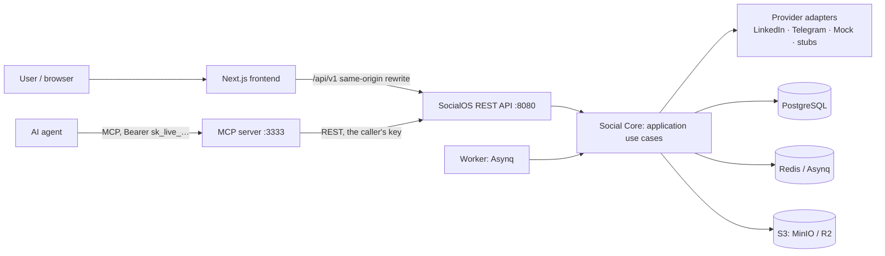

# SocialOS

SocialOS is one place to connect social accounts, compose posts once, tailor them per platform, and publish or schedule them. It also ships an **MCP server**, so external AI agents can manage a user's accounts through scoped, revocable credentials. For example: *"write a post about my new Flutter project and schedule it for tomorrow 12:00 on LinkedIn and Telegram"*.

SocialOS is a single abstraction layer over social-media APIs. Neither agents nor the UI ever talk to LinkedIn, Telegram or any other network directly.

| | |
|---|---|
| Backend | Go 1.24 · chi · pgx · PostgreSQL 16 · Redis + Asynq · S3 (MinIO / R2 / S3) |
| MCP | TypeScript · official `@modelcontextprotocol/sdk` · Streamable HTTP + stdio |
| Frontend | Next.js (App Router) · TypeScript · Tailwind CSS · shadcn/ui-style components |
| Networks (MVP) | **LinkedIn** (real adapter), **Telegram** (real adapter), **Mock** (dev/test). Instagram, Facebook, TikTok, YouTube, X, Threads and Pinterest are honest "not available" stubs |

The full design is in [`docs/ARCHITECTURE.md`](docs/ARCHITECTURE.md): ERD, state machine, API contract, scheduler and idempotency, OAuth flow and decisions. Deviations from it are listed in [`backend/DEVIATIONS.md`](backend/DEVIATIONS.md).

## 1. Architecture



The backend follows hexagonal architecture:

- **`internal/domain`** holds pure entities and rules: the post state machine, API-key scopes and typed errors. It does no I/O.
- **`internal/application`** holds use cases and their port interfaces: auth, accounts, posts, scheduler, media, developer, analytics and audit.
- **`internal/infrastructure`** holds the Postgres repositories, the Asynq queue, S3 storage and AES-GCM crypto.
- **`internal/adapters`** holds the social-network adapters behind small interfaces in `adapters/provider`.
- **`internal/transport`** holds the HTTP handlers, DTOs and middleware: request ID, logging, auth, CSRF, rate limiting, CORS and recover.

API and worker are two binaries of one module, so they share domain code. The MCP server is a separate service that only talks to the REST API, so it scales independently and can never bypass authorization.

**Security model in one paragraph:**

- *Browser auth:* opaque server-side sessions in an HttpOnly, SameSite cookie, with a CSRF header on mutating requests.
- *Agent auth:* API keys `sk_live_…`. Only the SHA-256 hash is stored, and the raw key is shown once. Each key belongs to one user and carries scopes, an expiry, revocation and `last_used_at`.
- *OAuth:* state plus PKCE. The state is single-use, expires after 10 minutes and is bound to the session user.
- *Data at rest:* OAuth tokens are encrypted with AES-256-GCM, and tokens are never logged.
- *Tenant isolation:* every query is scoped by `user_id`. Another user's resources return 404.
- *Uploads:* MIME types are sniffed server-side and sizes are limited.
- *Logging and errors:* every important action goes to the audit log, and errors use one uniform JSON shape without internals.

## 2. Local setup

**One command (Docker):**

```bash
make up                # = make env (creates .env with a fresh ENCRYPTION_KEY) + docker compose up -d --build
open http://localhost:3000
```

Services:

| Service | Address |
|---|---|
| frontend | :3000 |
| backend | :8080 |
| mcp | :3333/mcp |
| postgres | :5432 |
| redis | :6379 |
| minio | :9000, console :9001 |
| worker | none exposed |
| migrate | one-shot |

Use `make logs`, `make ps` and `make down` to watch, inspect and stop the stack.

**Without production credentials** the whole MVP still works. `SOCIAL_MOCK_PROVIDERS=true`, the default in `.env.example`, adds a "Mock Network" provider with a real OAuth-style redirect flow. Connect it twice with different hints (`/api/v1/social/mock/connect?account=linkedin`, then `?account=telegram`) to get two accounts. The mock is clearly labelled and refused in `APP_ENV=production`.

**Apps on the host, infrastructure in Docker** (hot reload): run `make dev` and follow the printed commands.

## 3. Environment variables

[`.env.example`](.env.example) is the compose-level file. Every backend option, with comments, is in [`backend/.env.example`](backend/.env.example). The most important ones:

| Variable | Purpose |
|---|---|
| `DATABASE_URL`, `REDIS_URL` | Postgres and Redis |
| `ENCRYPTION_KEY` | base64 of 32 bytes (`openssl rand -base64 32`); encrypts OAuth tokens. Keep it stable |
| `S3_ENDPOINT`, `S3_ACCESS_KEY`, `S3_SECRET_KEY`, `S3_BUCKET`, `S3_PUBLIC_ENDPOINT` | Object storage (MinIO / R2 / S3) |
| `API_PUBLIC_URL`, `WEB_BASE_URL`, `MCP_PUBLIC_URL`, `CORS_ALLOWED_ORIGINS` | Public URLs and the CORS allow-list (`*` is rejected) |
| `LINKEDIN_CLIENT_ID`, `LINKEDIN_CLIENT_SECRET` | LinkedIn app |
| `TELEGRAM_BOT_TOKEN` | Telegram bot (one per deployment, shared by all users) |
| `TELEGRAM_UPDATES_MODE` | How the bot receives chat posts: `polling` (default, the worker long-polls) or `webhook` |
| `TELEGRAM_WEBHOOK_SECRET` | Webhook mode only: secret Telegram echoes in `X-Telegram-Bot-Api-Secret-Token` (1-256 chars of `A-Z a-z 0-9 _ -`; 16+ in production) |
| `SOCIAL_MOCK_PROVIDERS` | Mock network (development only) |
| `COOKIE_SECURE`, `METRICS_TOKEN`, `RATE_LIMIT_*` | Hardening |

`JWT_SECRET` is intentionally absent. Sessions are opaque and revocable server-side, which is simpler and safer than JWT refresh logic for an MVP. Real secrets are never committed: `.env` is git-ignored.

## 4. Database migrations

SQL migrations live in `backend/migrations` (goose format) and are embedded in the binaries.

```bash
make migrate                         # docker: one-shot migrate service
make -C backend migrate              # host: uses backend/.env DATABASE_URL
```

The schema covers these tables: `users`, `sessions`, `oauth_states`, `social_accounts`, `oauth_credentials`, `posts`, `post_targets`, `media`, `post_media`, `scheduled_jobs`, `publication_attempts`, `api_keys`, `mcp_connections`, `audit_logs`, `analytics` and `telegram_link_codes`. Every table has UUID primary keys and `created_at`/`updated_at`. One user can own many accounts on the same platform, enforced by `unique(user_id, provider, provider_account_id)`.

## 5. Running the components individually

| Component | Command | Notes |
|---|---|---|
| Backend API | `make -C backend run-api` | `:8080`; `GET /health`, `GET /ready` (Postgres, Redis, S3), `GET /metrics` |
| Worker | `make -C backend run-worker` | Publishes due targets, retries with exponential backoff (max 5), runs a reconciler every minute and, in `polling` mode, long-polls Telegram for link codes (one worker at a time, via a Redis lease). Health on `:8081` |
| Frontend | `cd frontend && npm ci && npm run dev` | `:3000`. `npm run mock-api` serves the contract on `:8080` for UI work without the backend |
| MCP | `cd mcp && npm ci && npm run build && SOCIALOS_API_URL=http://localhost:8080 npm start` | HTTP mode. Add `--stdio` with `SOCIALOS_API_KEY` for stdio mode |

## 6. Tests

```bash
make test               # Go unit tests + MCP tests + frontend lint/typecheck/tests: no services, no credentials
make test-integration   # Go integration + e2e against real Postgres/Redis (TEST_DATABASE_URL, TEST_REDIS_URL)
make acceptance         # the MVP acceptance flow against a running stack (API + worker + MCP)
cd frontend && node scripts/e2e-real.mjs   # browser e2e against a running stack (Playwright)
```

The suites cover these areas:

- post state transitions;
- OAuth state validation: wrong user, reused or expired state;
- token refresh before publishing;
- scheduler, retries, backoff and the retry cap;
- idempotency: a re-run job never posts twice, and a crash after the provider call becomes `needs_review`;
- tenant isolation;
- scope authorization (`INSUFFICIENT_SCOPE`);
- CSRF, media validation and the uniform error format;
- LinkedIn and Telegram adapters against `httptest` fakes;
- MCP tool filtering by scope, confirm flags, error mapping and the SDK client over Streamable HTTP.

No test needs real OAuth credentials.

## 7. Social providers

### Capabilities, honestly reported

`GET /api/v1/social/providers` returns each provider's `capabilities`, which the UI uses to enable features and enforce limits: `can_publish_text`, `can_publish_image`, `can_publish_video`, `can_schedule`, `can_delete`, `can_analytics`, `max_text_length`, `max_media_count`, `requires_approval` and `notes`.

| Provider | Status | Notes |
|---|---|---|
| LinkedIn | Real | OAuth 2.0 + OpenID `userinfo`, `/rest/posts`. Text and image; video not in the MVP. Personal profiles via "Share on LinkedIn". **Company pages need Marketing Developer Platform approval** (`requires_approval`) |
| Telegram | Real | Bot API, not OAuth. One bot serves all users, so a chat is connected by posting a one-time code in it (proof of control), never by typing its name. Text, image, video, delete |
| Mock | Dev/test only | Deterministic; content containing `#mock-fail`, `#mock-retry`, `#mock-auth` or `#mock-unknown` simulates failures |
| Instagram, Facebook, TikTok, YouTube, X, Threads, Pinterest | Not available | Registered stubs returning `PROVIDER_NOT_AVAILABLE`. All need app review or business accounts, so they are not pretended to work |

### Adding a new social provider

The design uses small, optional interfaces (`backend/internal/adapters/provider/provider.go`) instead of one large `SocialProvider` interface. A provider implements only what the network really supports, and capabilities say the rest. The brief's methods map as follows:

| Brief | Interface method |
|---|---|
| Connect | `OAuth.AuthorizeURL` + `Exchange`, or `ChatVerifier.VerifyChat` for non-OAuth networks |
| RefreshToken | `OAuth.Refresh` |
| GetAccount | `OAuth.Profile` |
| PublishPost / CreatePost | `Publisher.Publish` (receives `IdempotencyKey`) |
| DeletePost | `Publisher.Delete` |
| GetPost | `Lookuper.Lookup` (used for crash recovery) |
| UpdatePost, GetAnalytics | Not in the MVP: no MVP network supports editing, and analytics needs approvals. Reported via `can_analytics=false` |

```go
// backend/internal/adapters/twitter/twitter.go
package twitter

type Provider struct{ cfg Config; http *http.Client }

func New(cfg Config) *Provider { … }
func (p *Provider) Name() string                        { return "x" }
func (p *Provider) DisplayName() string                 { return "X" }
func (p *Provider) Configured() bool                    { return p.cfg.ClientID != "" }
func (p *Provider) Supported() bool                     { return true }
func (p *Provider) Capabilities() provider.Capabilities { return provider.Capabilities{CanPublishText: true, MaxTextLength: 280, …} }
func (p *Provider) AuthorizeURL(a provider.AuthorizeParams) string { … }   // OAuth
func (p *Provider) Exchange(ctx context.Context, code, verifier, redirect string) (provider.Token, error) { … }
func (p *Provider) Profile(ctx context.Context, token string) (provider.Profile, error) { … }
func (p *Provider) Refresh(ctx context.Context, refresh string) (provider.Token, error) { … }
func (p *Provider) Publish(ctx context.Context, r provider.PublishRequest) (provider.PublishResult, error) { … }
func (p *Provider) Delete(ctx context.Context, r provider.DeleteRequest) error { … }
```

Then:

1. Register the adapter in `internal/app/app.go` with `reg.Register(twitter.New(…))`. It replaces the stub of the same name.
2. Add its config variables.
3. Write adapter tests against an `httptest` fake, using `adapters/linkedin/*_test.go` as the template.
4. Classify errors with `provider.Error{Kind: KindRetryable|KindPermanent|KindAuth|KindRateLimited}`, so the worker knows whether to retry.

No core business logic changes.

## 8. OAuth setup

**LinkedIn**

1. Create an app at <https://www.linkedin.com/developers/apps>.
2. Add the products **Sign In with LinkedIn using OpenID Connect** and **Share on LinkedIn**.
3. Add the redirect URL `${API_PUBLIC_URL}/api/v1/social/linkedin/callback`.
4. Put `LINKEDIN_CLIENT_ID` and `LINKEDIN_CLIENT_SECRET` in `.env`.

The requested scopes are `openid profile email w_member_social`. Posting to company pages additionally needs Marketing Developer Platform access.

**Telegram**

SocialOS runs **one bot for the whole deployment**. If connecting only needed the channel's `@username`, any user could attach somebody else's channel, because the bot is an admin of all of them. So a chat is linked only when the user proves they control it with a one-time code.

Setup (operator):

1. Create a bot with @BotFather and set `TELEGRAM_BOT_TOKEN`.
2. Choose how updates arrive with `TELEGRAM_UPDATES_MODE`:
   - `polling` (default): nothing else to do. The worker long-polls Telegram (`getUpdates`), so it works behind NAT and on localhost. Only one worker polls at a time (Redis lease), so you can run several. Do not run another consumer of the same bot token.
   - `webhook`: set `TELEGRAM_WEBHOOK_SECRET` (for example `openssl rand -hex 24`), make `API_PUBLIC_URL` an https address Telegram can reach and run `make -C backend telegram-set-webhook` (add `URL=https://…/api/v1/webhooks/telegram` to override). `make -C backend telegram-webhook-info` shows what Telegram has registered and `telegram-delete-webhook` removes it. Switching back to `polling` requires deleting the webhook first (Telegram refuses `getUpdates` while one is set; the worker logs a hint).

Connecting (user, on `/accounts`):

1. Click **Connect channel**. SocialOS shows a code such as `SOS-7KQ2M9XA`, valid for 15 minutes and usable once.
2. Add the bot to your channel or group as an administrator with the **Post messages** right.
3. Post the code in that chat as a normal message. The page detects it within a couple of seconds, shows the connected chat and the bot deletes your message.

Notes:

- In a group or supergroup only an administrator's code counts (anyone can post there). In a channel only admins can post anyway.
- A wrong, expired or reused code is ignored silently: the bot never replies in the chat.
- If the bot lacks the right to post, the code is kept: fix the permission and post it again before it expires.
- A bot that is an administrator receives every message of a group, so Telegram's privacy mode does not stop the bot from seeing the code. If a group still shows nothing, check that the bot really is an administrator.

The flow, after `GET /api/v1/social/{provider}/connect`:

1. Generate a random state; store its hash, the user, a PKCE verifier and a 10-minute TTL.
2. Redirect to the provider's consent page.
3. On `/callback`, validate the state: it must be unused, unexpired and owned by the session user.
4. Exchange the code and fetch the profile.
5. Upsert the account by the provider account ID (never by token) and encrypt its tokens.
6. Write an audit entry and redirect to `/accounts?connected=…`.

## 9. API documentation

All endpoints are under `/api/v1`. Errors look like this:

```json
{"error":{"code":"SOCIAL_ACCOUNT_EXPIRED","message":"LinkedIn authorization has expired","request_id":"…"}}
```

| Area | Endpoints |
|---|---|
| Auth | `POST /auth/register` · `POST /auth/login` · `POST /auth/logout` · `GET /me` (user, scopes, csrf_token) |
| Social | `GET /social/providers` · `GET /social/accounts` · `GET /social/accounts/{id}` · `GET /social/{provider}/connect` · `GET /social/{provider}/callback` · `POST /social/telegram/connect` (no body, returns a link code) · `GET /social/telegram/connect/{id}` (link status) · `DELETE /social/accounts/{id}` |
| Posts | `POST /posts` · `GET /posts?status=&from=&to=&cursor=` · `GET /posts/{id}` · `PATCH /posts/{id}` · `DELETE /posts/{id}` · `POST /posts/{id}/publish` · `/schedule` · `/cancel` · `/retry` · `GET /posts/{id}/status` |
| Media | `POST /media` (multipart; images ≤ 10 MB, video ≤ 100 MB; MIME sniffed) · `GET /media` · `GET /media/{id}` · `DELETE /media/{id}` |
| Insights | `GET /dashboard/summary` · `GET /analytics` · `GET /audit-logs` |
| Developer | `GET/POST /developer/api-keys` · `DELETE /developer/api-keys/{id}` · `GET/POST /developer/mcp-connections` · `DELETE /developer/mcp-connections/{id}` · `GET /developer/usage` |
| Ops | `GET /health` · `GET /ready` · `GET /metrics` |
| Webhook | `POST /webhooks/telegram` (only when `TELEGRAM_UPDATES_MODE=webhook`; authenticated by the `X-Telegram-Bot-Api-Secret-Token` header, not by session or key) |

**Post lifecycle.** Posts move `draft → scheduled → publishing → published | partially_published | failed`, and `draft|scheduled → cancelled`. Invalid transitions return `409 INVALID_STATE_TRANSITION`. Every attempt is recorded in `publication_attempts` with its number, times, status, error and response metadata.

**Idempotency.** Each target is published at most once:

1. The worker locks the target and skips it if it is already published.
2. It writes the attempt row and passes `IdempotencyKey = target.id` to the adapter.
3. If an attempt was left `started` by a crash, the target becomes `needs_review` instead of being re-posted blindly. That prefers a visible missed post over a duplicate.

## 10. MCP documentation

The MCP endpoint is `POST {MCP_PUBLIC_URL}` (Streamable HTTP) with `Authorization: Bearer sk_live_…`.

To get a key, create a connection in **Developer → MCP connections**. The UI shows the raw key and a ready-to-paste client config once. Each connection is an API key bound to one user, with only the scopes you tick. Dangerous scopes are unticked by default.

| Tool | Scope | Risk |
|---|---|---|
| `list_social_accounts`, `get_social_account` | `social:read` | safe |
| `list_posts`, `get_post`, `get_post_status` | `posts:read` | safe |
| `get_analytics` | `analytics:read` | safe |
| `create_draft`, `update_post` | `posts:write` | safe / low |
| `cancel_scheduled_post` | `posts:write` | medium |
| `schedule_post` | `posts:schedule` | medium |
| `publish_post` | `posts:publish` | **sensitive**, requires `confirm: true` |
| `delete_post` | `posts:delete` | **sensitive**, requires `confirm: true` |
| `disconnect_account` | `social:disconnect` | **critical**, requires `confirm: true` |

Tools without a granted scope are not even listed. The REST API enforces scopes again on every call, and every agent action is written to the audit log as `api_key:<name>`. Revoking the connection invalidates the key immediately. Keys can never create keys or change account security. Client configuration examples (Claude Desktop over stdio, HTTP clients, `mcp-remote`) are in [`mcp/README.md`](mcp/README.md). OAuth 2.1 authorization for MCP is the planned upgrade path; the key model already provides per-user binding, scopes, expiry and revocation.

## 11. Acceptance criterion

`make acceptance` runs this flow end to end against a running stack:

1. Register a user.
2. Connect two accounts.
3. Create an MCP connection without publish permissions.
4. An agent connects and sees only the allowed tools.
5. The agent calls `list_social_accounts`.
6. The agent calls `create_draft`.
7. The agent calls `schedule_post` for a few seconds ahead.
8. The worker publishes the post at the right time.
9. The API refuses a direct publish with the agent's key (`403 INSUFFICIENT_SCOPE`).
10. The dashboard counts the publication, and the audit log shows both the agent and the scheduler.

With real LinkedIn and Telegram credentials, the same flow runs with those providers instead of the mock.

## Production notes

- Set `APP_ENV=production`. Startup then refuses insecure cookies, the in-memory storage driver and the mock provider.
- Point `S3_*` at Cloudflare R2 or S3, and put the API, MCP and frontend behind TLS (`mcp.socialos.com`, …).
- The rate limiter is per instance. Move it to Redis when you scale horizontally.
- Metrics are Prometheus text format. OpenTelemetry tracing can wrap the existing request-ID and correlation-ID middleware.
