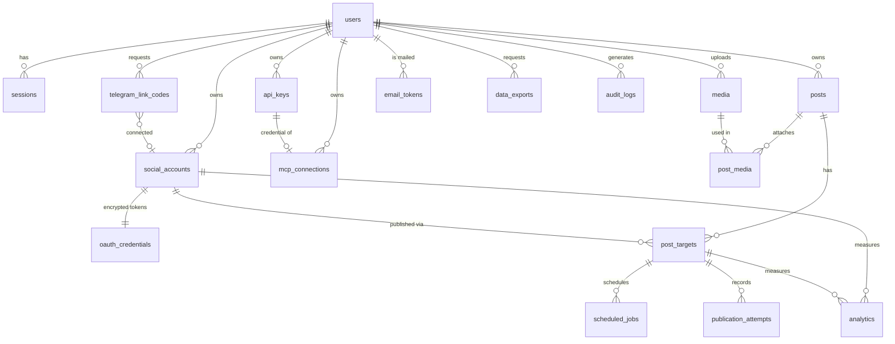

# Steerpost — Architecture & Contract

This document is the single source of truth for the backend, MCP server and frontend.
All three components are implemented against the contract below.

## 1. Services

```
User (browser) ──► Next.js frontend ─┐
                                      ├──► Steerpost REST API (Go, :8080) ──► Social Core ──► Adapters (LinkedIn, Telegram, Mock…)
AI agent ──► MCP server (TS, :3333) ──┘             │                             │
                                                     ├─ PostgreSQL (source of truth)
                                                     ├─ Redis + Asynq (queue)      ◄── Worker (Go) runs publish jobs
                                                     └─ S3 (MinIO / R2)
```

* **api** – Go HTTP server (chi). Stateless. Auth by session cookie (browser) or `Authorization: Bearer sk_live_…` (API key / MCP).
* **worker** – Go Asynq worker. Same module/images, `cmd/worker`. Runs `post:publish_target` jobs and, in the default `TELEGRAM_UPDATES_MODE=polling`, the single Telegram `getUpdates` long-poll that redeems link codes (§4 "Telegram linking").
* **mcp** – TypeScript, official `@modelcontextprotocol/sdk`, Streamable HTTP transport. Talks only to the REST API using the caller's API key. No DB, no social APIs.
* **frontend** – Next.js (App Router) + Tailwind + shadcn-style components. Talks to the REST API through a same-origin `/api` rewrite so session cookies are first-party.

### Key decisions (MVP: simplest production-ready choice)
| Decision | Choice | Why |
|---|---|---|
| Architecture | Hexagonal: `domain` (pure) → `application` (use cases, ports) → `infrastructure` / `adapters` / `transport` | Core logic has no framework or provider imports |
| HTTP router | chi | Small, idiomatic, std-lib compatible |
| DB access | pgx + hand-written SQL, goose-style SQL migrations | No ORM magic, easy to audit tenant filters |
| Auth (browser) | Opaque server-side sessions in Postgres, HttpOnly SameSite=Lax cookie, CSRF double-submit header for mutating requests | Revocable; simpler than JWT refresh |
| Auth (agents) | API keys `sk_live_…` (SHA-256 hash stored, scopes, expiry, revoke) bound to one user; each MCP connection = one API key | Works with every MCP client; OAuth 2.1 for MCP is a documented post-MVP upgrade |
| Token encryption | AES-256-GCM, key from `ENCRYPTION_KEY` (32 bytes base64), versioned ciphertext prefix `v1:` | Key rotation possible later |
| Queue | Asynq; scheduled jobs use `ProcessAt`; DB `scheduled_jobs` is truth, Redis is transport. A reconciler re-enqueues due-but-missing jobs every minute | Survives Redis flush |
| Idempotency | One `post_target` ⇒ at most one successful publish. Worker takes a row lock (`SELECT … FOR UPDATE SKIP LOCKED`) and an attempt row with unique `(post_target_id, attempt_no)`. Before calling a provider it stores `idempotency_key = post_target.id`. If `external_post_id` already set ⇒ no-op. Adapters that support provider idempotency pass the key; others rely on state check + "attempt in `unknown` state ⇒ adapter.GetPost lookup / mark `needs_review`" | See §6 |
| Storage | S3 API via minio-go; works with MinIO/R2/S3 by endpoint config | |

## 2. Domain rules

### Post state machine (enforced in `domain/post`)
```
draft ──schedule──► scheduled ──job starts──► publishing ──► published | partially_published | failed
  ▲                     │  ▲                                        │
  └────── unschedule ◄──┘  └────────────── retry failed ◄───────────┘ (failed/partially → scheduled|publishing via explicit retry)
draft|scheduled ──cancel──► cancelled        draft|scheduled|failed|cancelled|published may be deleted (soft delete)
draft ──publish now──► publishing
```
Allowed transitions table (anything else → `INVALID_STATE_TRANSITION`, 409):

| from | to |
|---|---|
| draft | scheduled, publishing, cancelled |
| scheduled | draft, publishing, cancelled |
| publishing | published, partially_published, failed |
| failed | scheduled, publishing |
| partially_published | scheduled, publishing (only failed targets are retried) |
| published, cancelled | — (terminal) |

Post status is derived from target statuses when all targets are terminal: all published → `published`; some → `partially_published`; none → `failed`.
Target statuses: `pending`, `publishing`, `published`, `failed`, `cancelled`, `needs_review`.

### Provider capabilities (returned by `GET /social/providers`)
```
ProviderCapabilities { CanPublishText, CanPublishImage, CanPublishVideo, CanSchedule (native), CanDelete, CanAnalytics,
                       MaxTextLength, MaxMediaCount, RequiresApproval bool, Notes string,
                       ConnectMethod ("oauth"|"telegram_chat"|"token"|"none"),
                       ConnectFields []ConnectField, MaxImageBytes int64, RequiresTitle bool }
```
`ConnectFields` (`connect_fields` in JSON) is the form of a `token` provider: `{name, label, help, placeholder, kind: text|secret|url, required, secret}`; `secret: true` marks a credential whatever its kind (a webhook URL is a `url` field and a password): it is rendered as a password input, never echoed, and the connect leak check treats it as a secret. `max_image_bytes` and `requires_title` are omitted when they do not apply. `CheckContent` applies the stricter of these limits and the account's own `metadata.limits` (`max_characters`, `max_media`, `max_image_bytes`), and requires a title when `requires_title` is set. See "Connect with a token" below.
* **LinkedIn** – real adapter (OAuth 2.0 auth-code, OpenID `userinfo`, `/rest/posts`, `w_member_social`). Text + image; video marked unsupported in MVP; company pages need Marketing Developer Platform approval (`RequiresApproval=true`, flagged in Notes). Analytics: false.
* **Telegram** – real adapter (Bot API). Not OAuth, and **one platform-wide bot** (`TELEGRAM_BOT_TOKEN`) serves every tenant. Because the bot is shared, knowing a channel's `@username` proves nothing: "the bot is admin there" is true for every user's channel. A chat is therefore connected only by **proof of control**: the user asks Steerpost for a one-time link code, adds the bot as admin with "Post messages" and posts the code in the chat. The bot sees the post (`channel_post` / group `message`), the backend matches the code to its owner, re-checks the bot's rights on that chat (`getChat`/`getChatMember`) and creates the `social_account` for **that user only**. There is no endpoint that takes a chat name or id. The bot token is never stored per account (account metadata keeps a `token_ref` only). Text, image, video, delete. Analytics: false.
* **mock** – deterministic in-memory/DB-less provider used by tests and `SOCIAL_MOCK_PROVIDERS=true` dev mode. Clearly labelled.
* **mocktoken** – the mock for the token connect flow (`SOCIAL_MOCK_PROVIDERS=true` only; production refuses mocks).
* instagram, facebook, tiktok, youtube, x, threads, pinterest, reddit, medium, hashnode – **registered as `unsupported` stubs** returning `PROVIDER_NOT_AVAILABLE` and capabilities with `RequiresApproval=true`. Not pretended to work.

## 3. Database (PostgreSQL 16)

All tables: `id uuid pk default gen_random_uuid()`, `created_at`, `updated_at timestamptz default now()` (omitted below for brevity). Every user-owned table has `user_id` and every query filters by it (tenant isolation).



```sql
users(id, email citext unique, password_hash, display_name, status ['active','disabled','deleted'],
      email_verified_at null, terms_accepted_at null, terms_version, plan default 'free', deleted_at null)   -- migration 00003
email_tokens(id, user_id FK, purpose ['verify_email','reset_password'], token_hash unique, email citext, expires_at, used_at null)   -- migration 00003; only the SHA-256 of the token is stored; a newer token of the same purpose retires older ones
data_exports(id, user_id FK, status ['pending','running','ready','failed','expired'], storage_key, size_bytes, error_code, expires_at null)   -- migration 00003; one active export per user; see Account data export (D-018)
account_deletions(id, user_id (no FK), requested_at, purged_at null, counts jsonb)   -- migration 00003, used by the deletion work; no PII on purpose
sessions(id, user_id, token_hash unique, csrf_token, expires_at, user_agent, ip)
oauth_states(id, user_id, provider, state_hash unique, code_verifier, redirect_after, expires_at, used_at)
social_accounts(id, user_id, provider, provider_account_id, username, display_name, avatar_url,
                scopes text[], metadata jsonb, status ['active','expired','revoked','error'], connected_at,
                unique(user_id, provider, provider_account_id))
telegram_link_codes(id, user_id FK, code_hash unique, expires_at, used_at, chat_id, social_account_id FK null, created_at, updated_at)   -- migration 00002; only the SHA-256 of the code is stored
oauth_credentials(id, social_account_id unique, access_token_enc, refresh_token_enc, expires_at, refresh_expires_at, key_version)
posts(id, user_id, title, status, scheduled_at, published_at, created_by ['user','api_key'], created_by_ref, deleted_at, quota_counted_at null)   -- quota_counted_at: migration 00003, used by the quota work
post_targets(id, post_id, user_id, social_account_id, platform, content, status, external_post_id,
             external_url, published_at, error_code, error_message, idempotency_key unique, attempt_count)
media(id, user_id, kind ['image','video'], mime_type, size_bytes, storage_key, original_name, width, height, status, sha256)
post_media(post_id, media_id, position, primary key(post_id, media_id))
scheduled_jobs(id, post_target_id, run_at, asynq_task_id, status ['pending','enqueued','done','cancelled'], unique(post_target_id) where status in ('pending','enqueued'))
publication_attempts(id, post_target_id, attempt_no, started_at, finished_at, status ['started','succeeded','failed','unknown'],
                     error_code, error_message, response_metadata jsonb, unique(post_target_id, attempt_no))
api_keys(id, user_id, name, prefix, key_hash unique, scopes text[], expires_at, revoked_at, last_used_at, dangerous_policy ['approve','trusted'] default 'approve')
action_approvals(id, user_id, actor_type ['api_key'], actor_id, actor_label, action, resource_type, resource_id, fingerprint, summary jsonb, status ['pending','approved','denied','consumed'] (past `expires_at` a pending or approved row is reported as `expired`), expires_at, decided_at, consumed_at)
mcp_connections(id, user_id, api_key_id, name, client_name, last_seen_at, revoked_at)
audit_logs(id, user_id, actor_type ['user','api_key','scheduler','system'], actor_id, actor_label, action, resource_type, resource_id, metadata jsonb, request_id, ip)
analytics(id, user_id, social_account_id, post_target_id null, metric, value bigint, captured_at)   -- MVP: table + endpoint, filled by adapters that CanAnalytics (none yet) and by internal counters
```
Indexes: `(user_id, status)`, `(user_id, scheduled_at)`, `post_targets(post_id)`, `scheduled_jobs(run_at) where status='pending'`, `audit_logs(user_id, created_at desc)`, `action_approvals(user_id, status, created_at desc)`, `action_approvals(expires_at)`, `telegram_link_codes(user_id, created_at desc)`, `telegram_link_codes(user_id, expires_at) where used_at is null`, `telegram_link_codes(expires_at)`, `email_tokens(user_id, purpose, created_at desc)`, `email_tokens(expires_at)`.

## 4. REST API (`/api/v1`)

Error format everywhere:
```json
{"error":{"code":"SOCIAL_ACCOUNT_EXPIRED","message":"LinkedIn authorization has expired","request_id":"…"}}
```
Codes: `VALIDATION_ERROR 400`, `UNAUTHENTICATED 401`, `FORBIDDEN 403` (also missing scope: `INSUFFICIENT_SCOPE`; also `EMAIL_NOT_VERIFIED` when the server enforces email verification and the owner has not verified, see Auth; also `QUOTA_EXCEEDED` when a plan limit is reached, see "Plan limits"), `APPROVAL_REQUIRED 428` (an API key attempted a dangerous action; see "Approvals"), `NOT_FOUND 404`, `INVALID_STATE_TRANSITION 409`, `CONFLICT 409`, `RATE_LIMITED 429`, `SOCIAL_ACCOUNT_EXPIRED 422`, `PROVIDER_NOT_AVAILABLE 501`, `PROVIDER_ERROR 502`, `INTERNAL 500`.
Pagination: `?limit=&cursor=` → `{"items":[…],"next_cursor":null|"…"}`. Times are RFC 3339 UTC.

### Auth
`POST /auth/register {email,password,display_name,accept_terms}` (`accept_terms` must be `true`, else `400 VALIDATION_ERROR` with `fields.accept_terms`; the current terms version and the time are stored in `users.terms_version` / `terms_accepted_at`, D-016) · `POST /auth/login` · `POST /auth/logout` · `GET /me`

Email verification and password recovery (mail goes through the queued mail port, D-006; links carry the token in the URL fragment, `{WEB_BASE_URL}/verify-email#token=…` and `/reset-password#token=…`):

| Endpoint | Auth | Result |
|---|---|---|
| `POST /auth/verify-email {token}` | public | `200 {"email_verified":true}`; unknown, used or expired token: `400 VALIDATION_ERROR` "link is invalid or has expired" |
| `POST /auth/verify-email/resend` | session | `202 {"status":"accepted","delivery":"log"\|"smtp"}`; already verified `409`; inside the 60 s cooldown `429` |
| `POST /auth/password/forgot {email}` | public | always `202 {"status":"accepted","delivery":"log"\|"smtp"}`, identical for known, unknown and malformed addresses; the handler only validates and enqueues an `auth:forgot` task, the worker does the lookup and sends the mail |
| `POST /auth/password/reset {token,password,revoke_keys?}` | public | `204`; sets the password, **revokes every session**, marks the email verified; API keys and MCP connections are revoked only with `revoke_keys: true`; invalid token `400`; a weak password is rejected without burning the token |
| `POST /auth/password/change {current_password,new_password,revoke_keys?}` | session | `204`; revokes every session **except the current one** (and keys only with `revoke_keys: true`); wrong current password `400` |

Tokens: 32 random bytes, stored as SHA-256, single use (atomic consume), TTL 48 h for verification and 30 min for reset; a new token retires the older ones of the same purpose, and at most 10 are issued per user and purpose per rolling 24 h (extra requests get the same response and no mail). If the last delivery retry fails, the token behind the mail is retired. Public endpoints sit behind the auth limiter plus a mail limiter (1 per minute, burst 3, per client). Audit actions: `user.email_verified`, `user.password_reset`, `user.password_changed` (metadata never contains tokens). A `password_changed` notice mail follows both password changes.

**Gating.** Verification is enforced only when `MAIL_PROVIDER=smtp` (otherwise nobody could receive the link). An unverified owner then gets `403 EMAIL_NOT_VERIFIED` on: starting an OAuth or Telegram connection, completing an OAuth or Telegram connection (the owner is checked at that moment), creating a scheduled post, scheduling, publishing or retrying a post, editing a post that is already scheduled, and creating API keys or MCP connections (sessions and API keys alike). Drafts, reading and everything else stay available. The scheduler and system actors are never blocked, so work a verified user already queued still publishes. Existing users start unverified (`email_verified_at` NULL); with `MAIL_PROVIDER=log` nothing is gated.

`GET /me` (also the body of register and login) adds `user.email_verified` (bool), `user.plan`, and top level `verification_enforced` (bool) and `mail_delivery` (`"log"` or `"smtp"`).

Browser mutating requests need header `X-CSRF-Token` (value returned by `GET /me` / login in `csrf_token`, also in cookie `socialos_csrf`). API-key requests are exempt.

### Social
`GET /social/providers` (capabilities + configured flag) · `GET /social/accounts` · `GET /social/{provider}/connect` (302 to provider; `?redirect=` allow-listed) · `GET /social/{provider}/callback` · `POST /social/telegram/connect` (non-OAuth; no body, mints a link code) · `GET /social/telegram/connect/{id}` (link status) · `POST /social/accounts/token` (connect with a pasted credential, see below) · `GET /social/accounts/{id}` · `DELETE /social/accounts/{id}` (disconnect)

### Connect with a token
`POST /social/accounts/token {provider, fields: {name: value}}` → `201` account (the same shape as `GET /social/accounts/{id}`). It is for providers whose `connect_method` is `token`; the form comes from `connect_fields`. It needs the **critical** scope `social:connect` (browser sessions hold every scope; API keys must be granted it explicitly, and it is never in the default set, see D-009), is CSRF-protected for sessions and shares the `link:` rate limit of the Telegram link start.

1. Unknown field names are rejected, required fields must be non-empty, each value is at most 2 KB, and `url` fields must be `https` without credentials. Error messages never echo a value.
2. The adapter's `Verify` makes a live whoami call with a 10 s timeout. Rejected credentials (auth or permanent failure) answer `400 VALIDATION_ERROR` "<Provider> rejected these credentials"; other failures follow the usual provider mapping (`502 PROVIDER_ERROR`).
3. The adapter returns a non-secret profile (it becomes `metadata`, which the API returns) and the secret credential. The secret is encrypted into `oauth_credentials` with the same AES-GCM vault as OAuth tokens; it has no expiry and is never refreshed. A profile that contains the credential is refused (`500`).
4. Reconnecting repeats the same POST: the account is upserted by provider account id and an `expired` account becomes `active`. The audit entry `social_account.connected` carries provider, username and provider account id only.

The worker loads credentials for `token` accounts like for OAuth ones. A 401-style failure marks the account `expired` (`SOCIAL_ACCOUNT_EXPIRED`) and the user reconnects. Outbound calls to hosts a user supplies go through the SSRF-safe client (`adapters/safehttp`, D-010).

### Telegram linking (proof of control)
Both endpoints are **session only** (API keys get 403) and the POST is CSRF-protected and rate-limited per user (the auth limiter, key prefix `link:`).

* `POST /social/telegram/connect` takes **no chat**. It creates a link code bound to the session user and returns `201 {id, code, expires_at, bot_username, instructions}`, e.g. `SOS-7KQ2M9XA`. A `{chat}` body, if a stale client still sends one, is ignored: it can never name a chat.
* `GET /social/telegram/connect/{id}` returns `{status: "pending"|"connected"|"expired", account?}`. It is tenant-scoped: another user's id, an unknown id and a malformed id are all `404 NOT_FOUND`.

Code: `SOS-` plus 8 characters drawn by rejection sampling from `crypto/rand` over an unambiguous 31-character alphabet (no `0 O 1 I L`), about 40 bits. Only its SHA-256 is stored (`telegram_link_codes.code_hash`, unique), so a database read does not reveal usable codes. TTL 15 minutes, **single use**, at most 3 active codes per user (creating a fourth retires the oldest).

Redemption (`application/accounts.HandleChatUpdate`, the single entry point for both intake modes):

1. The adapter (`adapters/telegram`) parses the update into a provider-neutral `ChatMessage`. Only `channel_post` and group/supergroup `message` count; edits, private chats, bot senders, other update types and messages posted on behalf of another chat are ignored.
2. The message must consist of the code and nothing else (surrounding whitespace and letter case are ignored). Anything else is dropped before hashing.
3. The hash is looked up; the code must be unused and unexpired. Otherwise nothing happens: **no reply**, only a debug log without the code.
4. In a group or supergroup anyone can post, so the **sender must be the creator or an administrator** (`getChatMember`), or an anonymous admin posting as the group. A channel post is trusted by construction: only admins can post there.
5. The existing `VerifyChat` checks run on that chat id: the bot must be an administrator and, for channels, hold "Post messages". If not, the code is **not** burned, so the user can fix the rights and post it again.
6. One transaction upserts the `social_account` for the code's owner, writes an audit entry (actor `system`, source `telegram`) and marks the code used with the `chat_id` and account id.
7. Best effort: `deleteMessage` removes the code message from the chat.

Update intake, `TELEGRAM_UPDATES_MODE` (both modes call the same method):

| Mode | How |
|---|---|
| `polling` (default) | A goroutine in the worker long-polls `getUpdates` (`timeout=25`, `allowed_updates=channel_post,message,my_chat_member`). A Redis lease (`SET NX PX`, renewed while polling) guarantees that only one worker polls; the next offset lives in Redis and is committed only while the lease is held. Errors back off exponentially with jitter (honouring `retry_after`); an update that keeps failing is dropped after 5 attempts. A 409 means a webhook is registered: the poller logs how to remove it and never deletes it on its own. |
| `webhook` | `POST /api/v1/webhooks/telegram`, outside the session/CSRF stack. The `X-Telegram-Bot-Api-Secret-Token` header is compared with `TELEGRAM_WEBHOOK_SECRET` in constant time, else `401`. The body is limited to 256 KiB and, once the secret is verified, the answer is always `200 {"ok":true}` (a garbage body must not make Telegram redeliver forever). The route is mounted only in this mode (404 otherwise). Register it with `make -C backend telegram-set-webhook`, which calls `setWebhook` with `secret_token`. |

Security properties: user B cannot connect user A's channel without posting a code B created in it, so B must be able to post in that chat; B polling A's link id gets 404; expired, reused and unknown codes connect nothing. Residual risk: anyone who is an administrator of a chat where the bot is an administrator can link it to their own account. That is the proof of control the design relies on.

### Posts
`POST /posts {title?, content, social_account_ids[], media_ids[]?, targets?:[{social_account_id, content}], scheduled_at?}` → creates **draft** (or scheduled when `scheduled_at` given and `schedule:true`)
`GET /posts?status=&from=&to=&limit=&cursor=` · `GET /posts/{id}` (includes targets, media, attempts) · `PATCH /posts/{id}` (draft/scheduled only) · `DELETE /posts/{id}`
`POST /posts/{id}/publish` · `POST /posts/{id}/schedule {scheduled_at}` · `POST /posts/{id}/cancel` · `POST /posts/{id}/retry` · `GET /posts/{id}/status`

### Media
`POST /media` (multipart `file`; ≤ 100 MB video / 10 MB image; MIME sniffed server-side from the first bytes; allow-list jpeg/png/webp/gif, mp4/quicktime; the body is streamed to S3 in 5 MiB parts, size enforced while streaming, at most `MEDIA_UPLOAD_CONCURRENCY` (2) at once, then `429 RATE_LIMITED` + `Retry-After`; the web UI posts it directly to the API host, see D-015) · `GET /media` · `GET /media/{id}` (includes short-lived `url`) · `DELETE /media/{id}`

### Analytics & dashboard
`GET /analytics?from=&to=` · `GET /dashboard/summary` → `{connected_accounts, scheduled_posts, drafts, published_this_month, failed, upcoming:[…], recent:[…]}`
`GET /audit-logs?limit=&cursor=&action=` (session only; `action` keeps one action, e.g. `mcp.tool_call` for agent actions)

### Plan limits (D-014)
One `free` plan; the limits come from env and are **off by default** (`-1` = unlimited, so an update never caps an existing install); a public instance sets positive numbers. The application layer counts under a per-user lock (`SELECT … FOR NO KEY UPDATE` on the user row, taken in the same transaction as the change), so parallel requests cannot pass the check together. A refusal is `403 QUOTA_EXCEEDED` with `fields.quota` naming the metric and a message that says what to do; nothing is changed.

| Metric (`fields.quota`) | Env, default | Counted | Checked in |
|---|---|---|---|
| `connected_accounts` | `QUOTA_ACCOUNTS` (e.g. 5) | non-revoked social accounts; reconnecting one you have is free | `accounts.connectAccount` (OAuth, token and chat connects); an early `PrecheckAccount` (no lock) runs before an OAuth start and before a token connect spends its approval; a chat link refused at the limit is dropped, not retried |
| `scheduled_posts_month` | `QUOTA_POSTS_PER_MONTH` (e.g. 60) | posts whose `quota_counted_at` is in the current UTC month; set when a post is scheduled or published, and set again (counted anew) when it is scheduled or published in a later month. Drafts are free, unschedule then schedule within the month does not count twice, deleting does not give it back | `posts.scheduleLocked`, `posts.startPublishing`; checked before the approval, so the owner is not asked about an action the plan refuses |
| `media_bytes` | `QUOTA_MEDIA_MB` (e.g. 500) | sum of `media.size_bytes`; deleting media frees it | `media.Upload` (checked with the streamed byte count in the transaction of the insert; a refused upload's object is deleted) |
| `agent_requests_per_minute` | `QUOTA_AGENT_RPM` (e.g. 120) | requests of all API keys and MCP connections of one user together (in memory, per API instance); browser sessions are not limited | `middleware.AgentRateLimit`; over the cap it is `429 RATE_LIMITED` with `Retry-After` |

`GET /account/usage` (scope `analytics:read`) → `{plan, period_start, period_end, quotas:{connected_accounts:{used,limit}, scheduled_posts_month:{used,limit}, media_bytes:{used,limit}, agent_requests_per_minute:{limit}}}`; `limit` -1 = unlimited. The MCP tool `get_usage` returns it.

### Account data export (D-018)
Session only: an API key gets `403` on all of these, whatever its scopes.

| Endpoint | Result |
|---|---|
| `POST /account/exports` | `202 {id, status:"pending", size_bytes, error_code, created_at, expires_at}`. `409` while an export is pending or running; `429` with `Retry-After` within 24 hours of the last successful export |
| `GET /account/exports` | `{items:[…]}`, newest first (at most 20); `status` is `pending`, `running`, `ready`, `failed` or `expired` (a ready export past `expires_at` is reported `expired` before the sweep deletes it) |
| `GET /account/exports/{id}` | the item plus `url` and `url_expires_at` (5 minutes); `404` for another user's id, `409` unless the export is ready and not expired. Audited as `account.export_downloaded` |

The worker (`account:export` task) streams a ZIP to `users/<uid>/exports/<id>.zip`: `README.txt`, `profile.json`, `social_accounts.json`, `posts.json` (targets and attempts nested), `media.json` and `media/<id><ext>`, `api_keys.json`, `mcp_connections.json`, `approvals.json`, `audit_logs.json`. Never included: password hash, API keys or their hashes, session values, network credentials. `EXPORT_RETENTION_DAYS` (default 7, max 30) sets how long the ZIP stays; an hourly sweep deletes it. Audit actions: `account.export_requested|export_ready|export_failed|export_downloaded`.

### Approvals
Dangerous actions made with an **API key** (not a browser session) need the owner's approval first (D-013): `POST /posts/{id}/publish`, `POST /posts/{id}/retry` without `scheduled_at`, `DELETE /posts/{id}`, `DELETE /social/accounts/{id}`, `POST /social/accounts/token`, and any schedule (`POST /posts` with `schedule`, `POST /posts/{id}/schedule`, `PATCH /posts/{id}` or `POST /posts/{id}/retry` with a time) less than `AGENT_MIN_SCHEDULE_LEAD` (default 5m) ahead. The scope check comes first (403); then, for a key whose `dangerous_policy` is `approve` (the default), the call answers `428` and does nothing:
`{"error":{"code":"APPROVAL_REQUIRED","message":"…","request_id":"…","fields":{"approval_id":"<uuid>","approve_url":"<WEB_BASE_URL>/approvals","expires_at":"<RFC 3339>","action":"post.publish|post.retry_now|post.delete|social_account.disconnect|social_account.connect_token|post.schedule_soon"}}}`
The owner decides in the browser: `GET /approvals?status=pending|all&limit=&cursor=` · `GET /approvals/{id}` · `POST /approvals/{id}/approve` · `POST /approvals/{id}/deny` (session only; a key gets 403; other tenants get 404; a decided or expired approval gets 409). The agent then repeats the **identical** call with the header `X-Approval-Id: <approval_id>` (a header, so DELETE needs no body). It succeeds once: the approval is bound to the key, the action, the target and a hash of the payload (a post is bound to its `updated_at`, so editing it voids the approval; a create-and-schedule to the whole body; a token connect to an HMAC, keyed by an HKDF subkey of `ENCRYPTION_KEY`, of every submitted value), and it is spent in the same transaction as the action. Anything else (reuse, another key, another target, an edited payload, a pending or expired id, another tenant's id) answers `428` with a fresh approval and no hint about why; an approval the owner denied answers `403`. Asking again while one is open returns the same `approval_id`; at most `APPROVAL_MAX_PENDING` (10) are open per **key**, then `429` (the check and the insert run under a per-key advisory lock, so parallel first calls make one row and cannot exceed the cap). Editing a post that runs within the minimum lead is gated even if the time is untouched, and an approval for an edit covers the post as it will be after the edit (text, per-network text, media, time), so it cannot be replayed with other content. The owner's summary shows the full text, every per-network text, the media counts and the time. Decided and expired approvals are deleted after `APPROVAL_RETENTION` (30d; the worker purges hourly). Env: `APPROVAL_TTL` (10m), `APPROVAL_MAX_PENDING`, `AGENT_MIN_SCHEDULE_LEAD` (`0` turns the lead rule off). Audit: `approval.requested|approved|denied|used`. A key created with `dangerous_policy: "trusted"` skips approvals (session only, on creation); sessions, the scheduler and system actors never need them.

### Developer
`GET/POST /developer/api-keys {name, scopes[], expires_at?, dangerous_policy?}` (raw key returned once; `dangerous_policy` is `approve` by default) · `DELETE /developer/api-keys/{id}` (revoke)
`GET/POST /developer/mcp-connections {name, scopes[]}` (creates key, returns raw key once + ready-to-paste config) · `DELETE /developer/mcp-connections/{id}` · `GET /developer/usage`

### Audit actions and MCP headers
Audit actions: `user.registered|login|logout`, `social_account.connected|disconnected|expired`, `post.created|updated|deleted|scheduled|unscheduled|cancelled|publish_requested|retried|completed`, `post_target.published|failed|needs_review`, `media.uploaded|deleted`, `approval.requested|approved|denied|used`, `api_key.created|revoked`, `mcp_connection.created|revoked`, `api_key.request` (any API-key request without a tool name), **`mcp.tool_call`** (one MCP tool call, see D-007).

An API-key request that carries `X-MCP-Tool: <tool_name>` (must match `^[a-z_]{1,64}$`, otherwise it is dropped and the request is recorded as `api_key.request`) is audited as one `mcp.tool_call` row instead. Metadata is an allow-list: `tool`, `method`, `route` (pattern, never the raw path), `status`, `error_code`, `target_ids` (UUID URL params `id` / `*_id`), `client` (key label, `MCP: <name>` for MCP connections), `credential_id` (key id, never the key), `via_gateway`; the row's `ip` is the client IP. Headers, query strings, bodies and tokens never reach the log.

| Header | Direction | Meaning | Trusted when |
|---|---|---|---|
| `X-MCP-Tool` | MCP server → API | tool name behind the request | descriptive only (any key holder can set it), API-key actors only |
| `X-SocialOS-Gateway` | MCP server → API | the shared secret `MCP_GATEWAY_SECRET` | constant-time equal; empty secret = never |
| `X-SocialOS-Client-IP` | MCP server → API | end client's IP as the MCP server saw it (same right-to-left `TRUST_PROXY`/`TRUSTED_PROXIES` rule as the API) | only together with a valid gateway header, else ignored. Stdio mode sends neither |

Env: `MCP_GATEWAY_SECRET` (backend and mcp share it; min 32 chars, empty = disabled; `deploy/init-env.sh` generates it). The usage counters (`GET /developer/usage`) count both `api_key.request` and `mcp.tool_call`.

### Ops
`GET /health` (liveness) · `GET /ready` (Postgres + Redis + S3) · `GET /metrics` (Prometheus text, basic counters, optionally token-protected)

### Scopes
`social:read` (accounts, providers) · `posts:read` · `posts:write` (create/update drafts, cancel) · `posts:schedule` · `posts:publish` (**sensitive**) · `posts:delete` (**sensitive**) · `social:disconnect` (**critical**) · `social:connect` (**critical**, hands a network credential to Steerpost) · `media:write` · `analytics:read`.
Browser sessions have all scopes. API keys carry only granted scopes; `publish`, `delete`, `connect`, `disconnect` are never in default sets; UI shows them under a "Dangerous" heading and requires confirmation. Using them with a key also needs the owner's approval per action (Approvals, D-013). API keys can never create/revoke API keys, or change password (session-only).

## 5. MCP tools

Transport: Streamable HTTP at `POST /mcp` with `Authorization: Bearer sk_live_…` (also stdio mode for local clients using `SOCIALOS_API_KEY`). Tool list is **filtered by the key's scopes** (fetched from `GET /me`); every call is additionally enforced by the REST API.

| Tool | Scope | Risk | REST |
|---|---|---|---|
| list_social_accounts | social:read | safe | GET /social/accounts |
| get_social_account | social:read | safe | GET /social/accounts/{id} |
| list_posts | posts:read | safe | GET /posts |
| get_post | posts:read | safe | GET /posts/{id} |
| get_post_status | posts:read | safe | GET /posts/{id}/status |
| get_analytics | analytics:read | safe | GET /analytics |
| get_usage | analytics:read | safe | GET /account/usage |
| create_draft `{content, social_account_ids[], media_ids?, title?, per_platform_content?}` | posts:write | safe | POST /posts |
| update_post | posts:write | low | PATCH /posts/{id} |
| schedule_post `{post_id, scheduled_at, approval_id?}` | posts:schedule | medium | POST /posts/{id}/schedule |
| cancel_scheduled_post | posts:write | medium | POST /posts/{id}/cancel |
| publish_post `{post_id, approval_id?}` | posts:publish | sensitive | POST /posts/{id}/publish |
| delete_post `{post_id, approval_id?}` | posts:delete | sensitive | DELETE /posts/{id} |
| disconnect_account `{account_id, approval_id?}` | social:disconnect | critical | DELETE /social/accounts/{id} |

Dangerous tools carry no `confirm` flag any more: the REST API answers `APPROVAL_REQUIRED` (428) and the tool returns the `approval_id`, where the owner approves (`approve_url`) and when it expires; the agent repeats the identical call with `approval_id`, which the tool sends as `X-Approval-Id`. `update_post` and `schedule_post` take `approval_id` too, for schedules under 5 minutes ahead. The tools carry MCP annotations (`destructiveHint`, `readOnlyHint`). Every REST call made via an API key writes an audit log with actor `api_key` / key name; tool calls are recorded as `mcp.tool_call` with the tool name (the MCP server sends `X-MCP-Tool` on every tool call, see §4 "Audit actions and MCP headers").

## 6. Scheduler / publishing flow & idempotency

1. `schedule`: tx { post → `scheduled`, `scheduled_at`; per target insert `scheduled_jobs(pending)` } → enqueue Asynq task `publish:target` `ProcessAt(scheduled_at)`, `TaskID = target.id + ":" + run_at`, `MaxRetry(5)`, `Retention`. Store `asynq_task_id`, mark `enqueued`.
2. Worker handler `publish:target(target_id)`:
   1. tx: lock the post, then the target `FOR UPDATE SKIP LOCKED` (see lock order below); skip if status ∈ {published, cancelled}; if `external_post_id` set → mark published, return. Move post `scheduled → publishing` (idempotent), target → `publishing`, insert attempt `started` (`attempt_no = attempt_count+1`).
   2. Load account; if `expires_at` within 5 min → `provider.RefreshToken`; failure → account `expired`, target `failed` with `SOCIAL_ACCOUNT_EXPIRED` (non-retryable).
   3. Load media (presigned/streamed from S3), call `provider.PublishPost(ctx, req{IdempotencyKey: target.id})`.
   4. Success: in one tx set `external_post_id`, `published`, attempt `succeeded`, recompute post status. Failure: classify retryable (network, 5xx, 429) vs permanent; retryable → attempt `failed`, return error so Asynq retries with exponential backoff (`30s·2^n`, jitter, max 5); permanent or retries exhausted → target `failed`.
   5. Crash between provider success and DB commit: attempt row remains `started`. On the next try the worker sees a stale `started` attempt → marks it `unknown` and, if provider supports `GetPost`/lookup by idempotency key (Telegram: none; LinkedIn: none) sets target `needs_review` instead of re-posting blindly, unless the adapter declares `SafeToRetryAfterUnknown`. This prefers a missed post over a duplicate and is visible in UI.
3. `cancel` before run: target/jobs → `cancelled`, Asynq task deleted; worker also re-checks status so a late job is a no-op.
4. **Reconciler** (worker, every minute): finds `scheduled_jobs` `pending|enqueued` with `run_at < now() - 1m` without a live task and re-enqueues; also recovers `publishing` targets stuck > 15 min.

**Lock order (#38).** Every transaction that locks rows takes the **post first, then its targets**, then anything else (`scheduled_jobs`, `publication_attempts`, `action_approvals`, user-level advisory rows). The `users` row taken for the quota (`FOR NO KEY UPDATE`, D-014) is locked after the post (the post lock is always first), not necessarily after its targets: `Retry` takes it before resetting targets and `Create` before inserting the post. The API (`cancel`, `unschedule`, `publish`, `retry`, `schedule`, edits, approval consumption inside them) starts with `GetForUpdate(post)`. The worker follows the same order: `LockTarget` (used by `begin` and the reconciler's `lockedRun`) reads the target's post id, locks the post, and only then locks the target; `relock` locks the post, then the target. The post lock is the gate: while it is held nobody else can lock that post's targets or jobs, so the lower rows cannot deadlock. A path must never take a post lock while holding a target, job or approval lock. Postgres deadlock (`40P01`) and serialization (`40001`) errors are mapped to `CONFLICT` with a `Retry-After: 1` header (other conflicts, such as duplicates, carry no `Retry-After`) instead of a 500 as a safety net.

## 7. OAuth flow
```
Browser ─GET /social/linkedin/connect (session)─► API: state=random 32B, store sha256(state)+user_id+PKCE verifier (10 min TTL)
        ◄─302 provider authorize?client_id&redirect_uri&state&scope─
User consents → provider ─302 /api/v1/social/linkedin/callback?code&state─► API
API: lookup state hash, ensure unused+unexpired AND belongs to the session user, mark used → exchange code → fetch profile
     → upsert social_account(user_id, provider, provider_account_id) → encrypt+store tokens → audit → 302 {WEB_BASE_URL}/accounts?connected=linkedin
```
Errors redirect to `/accounts?error=<code>`; tokens never logged; provider id (not token) identifies the account.

## 8. Backend layout (hexagonal, differences from the brief explained)
```
backend/
  cmd/api  cmd/worker  cmd/migrate  cmd/telegram (setWebhook / deleteWebhook / webhookInfo)
  internal/
    domain/        user socialaccount post media job apikey audit linkcode      (entities, state machine, errors; no I/O)
    application/   auth accounts posts scheduler media developer analytics audit   (use cases + port interfaces)
    infrastructure/ postgres redis storage crypto queue(asynq) clock
    adapters/      provider(interface, registry, capabilities)  linkedin telegram(+update parsing, poller, webhook helpers) mock stubs(instagram tiktok youtube twitter …)
    transport/     http(handlers, router, dto) middleware(requestid, logging, auth, csrf, ratelimit, cors, recover)
    config/ observability/
  migrations/  Dockerfile  Makefile
```
Differences: `social` ports live in `application` (not `domain`) because they are I/O contracts; `observability` added; one module hosts API+worker to share domain code.

## 9. Runnable without production credentials
Everything (api, worker, mcp, frontend, Postgres, Redis, MinIO) runs locally; with `SOCIAL_MOCK_PROVIDERS=true` the "mock" provider appears as a connectable network so the full acceptance flow works end-to-end. LinkedIn/Telegram code is real but exercised in tests against `httptest` fakes; live use needs `LINKEDIN_CLIENT_ID/SECRET` (+ redirect URI registered, product "Share on LinkedIn" / "Sign In with LinkedIn using OpenID Connect") and `TELEGRAM_BOT_TOKEN` (bot added as channel admin).

## 10. Phases
1 skeleton+contract · 2 auth/users/accounts/Postgres · 3 LinkedIn · 4 Telegram · 5 posts+scheduler+Asynq · 6 media+MinIO · 7 MCP · 8 frontend dashboard/composer/calendar · 9 developer portal · 10 tests · 11 docker+docs · 12 E2E verification.
